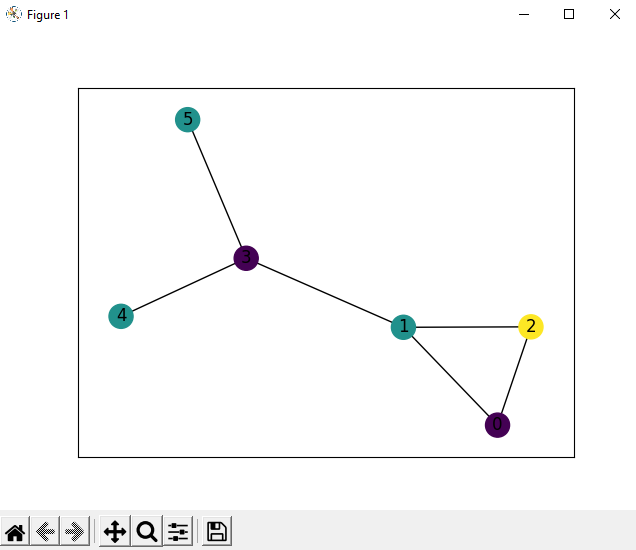
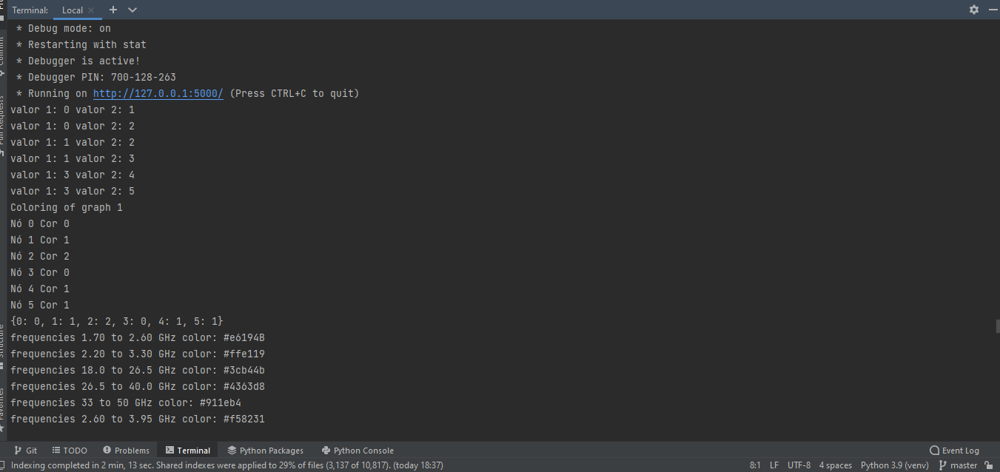

# Tores de Radio

**Conteúdo da Disciplina**: Grafos/Algoritmos ambiciosos 

## Alunos
|Matrícula | Aluno |
| ----------- | ------------------------------|
| 17/0034992  |  Gustavo Afonso Pires Severo  |
| 17/0011119  |  Geraldo Victor Alves Barbosa |

## Sobre 
O obejtivo do projeto é analisar qual a quantidade mínima de frequências devem ser emitidas por emissores de frequências 
de forma que as ondas de uma emissão não interfiram com outras iguais. 

## Screenshots
.

.

.

## Instalação 
**Linguagem**: Python3 
**Framework**: Flask 

Existe um arquivo de requirements.txt que deve ser instalado para que o projeto rode com as dependências corretas.

## Uso 
Para usar o projeto, rode o servidor, acesse o local host e suba o arquivo com os pares de arestas,
existe um exemplo de como o txt deve ser na raiz do projeto, mas basicamente é um par por linha separado por vírgula. 
1,2 
2,3 
3,4 
4,5 
5,1 

